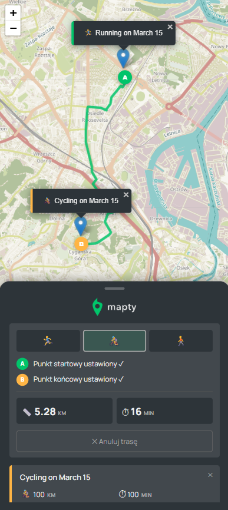

# 🗺️ Mapty — Map Your Workouts

> A workout tracking app built with **vanilla JavaScript** and **Leaflet.js** — log your runs and cycling sessions directly on an interactive map, plan routes from A to B, and keep your training history saved in the browser.


---

## 🚀 Live Demo

👉 **[mapty.github.io](https://YOUR_USERNAME.github.io/YOUR_REPO)**

---

## 📸 Preview

> 

> 

---

## ✨ Features

### 🏃 Workout Logging
- Click anywhere on the map to log a new workout
- Supports two workout types: **Running** and **Cycling**
- Running tracks: distance, duration, pace (min/km), cadence (spm)
- Cycling tracks: distance, duration, speed (km/h), elevation gain
- Each workout gets a **pin on the map** with a popup label
- Click a workout in the list to fly to its location on the map
- **Delete** any workout with the ✕ button — removes it from the map and history

### 🗺️ Route Planner (A → B)
- Click **"Plan Route A → B"** to enter route mode
- Click two points on the map to set start and end
- Route is calculated along **real streets** using OSRM (OpenStreetMap Routing)
- Choose your activity to get accurate time estimates:
  - 🏃‍♂️ Running (~10 km/h)
  - 🚴‍♀️ Cycling (~20 km/h)
  - 🚶 Walking (~5 km/h)
- Animated **loading indicator** while the route is being calculated
- Displays total **distance** and **estimated time**
- Switch activity mode after the route is drawn — time recalculates instantly

### 💾 Persistent Storage
- All workouts are saved to **localStorage**
- Your training history survives page refreshes automatically
- No account or backend required

### 📱 Mobile Responsive
- Fully adapted for phones and tablets
- Map fills the entire screen
- Sidebar slides up from the bottom (like Google Maps / Strava)
- **Drag the handle** to expand or collapse the panel — snaps to 3 positions
- "Add Workout" button visible on mobile (no Enter key needed)
- Delete buttons always visible on touch devices

---

## 🛠️ Technologies

| Technology | Purpose |
|---|---|
| **Vanilla JavaScript (ES2022)** | Core app logic, OOP with classes |
| **Leaflet.js v1.6** | Interactive map rendering |
| **Leaflet Routing Machine v3.2** | A→B route calculation |
| **OSRM** | Free open-source routing engine (no API key needed) |
| **OpenStreetMap** | Map tiles |
| **LocalStorage API** | Persistent workout data |
| **Geolocation API** | Auto-center map on user's location |
| **Intersection Observer API** | (extended from original project) |
| **CSS Custom Properties** | Design tokens / theming |
| **Google Fonts — Manrope** | Typography |

---

## 🏗️ Architecture

The app is built around two main class hierarchies:

### Class Diagram


### App Flow


### Key Design Decisions

- **OOP with private class fields** (`#map`, `#workouts`, `#markers`) — encapsulation without closures
- **`#markers` Map** — stores `id → L.marker` references to enable deleting individual pins
- **Single map click handler** (`_handleMapClick`) — routes clicks to either the workout form or the route planner depending on active mode, keeping concerns separated
- **Activity speed lookup table** (`#activitySpeeds`) — decouples time calculation from the routing response, allowing instant recalculation when the user switches mode

---

## 📁 Project Structure

```
mapty/
├── index.html          # App shell + Leaflet CDN imports
├── script.js           # All app logic (Workout, Running, Cycling, App classes)
├── style.css           # Styles + mobile responsive breakpoints
├── logo.png
├── icon.png
└── README.md
```

---

## ⚙️ Running Locally

No build tools required.

```bash
# Clone the repo
git clone https://github.com/YOUR_USERNAME/YOUR_REPO.git
cd YOUR_REPO

# Serve with any static server, e.g.:
npx serve .
# or
python3 -m http.server 8080
```

> ⚠️ **Note:** The Geolocation API requires HTTPS or `localhost`. Opening `index.html` directly via `file://` will block location access.

---

## 🚀 Deploying to GitHub Pages

1. Push all files to a GitHub repository
2. Go to **Settings → Pages**
3. Set source to **branch: `main`**, folder: `/ (root)`
4. Your app will be live at `https://YOUR_USERNAME.github.io/YOUR_REPO`

No server needed — everything runs in the browser.

---

## 🔮 Potential Improvements

- [ ] Edit existing workouts
- [ ] Sort / filter workouts by date, distance, type
- [ ] Charts and stats overview (weekly km, elevation)
- [ ] Replace Leaflet Routing Machine with **MapLibre GL JS** for faster routing
- [ ] Migrate to **TypeScript** for type safety
- [ ] Export workouts as GPX or CSV

---

## 📝 Credits

Original project concept by [Jonas Schmedtmann](https://twitter.com/jonasschmedtman) — used for learning purposes.  
Extended with routing, mobile support, and delete functionality.

---

## 📄 License

For learning and portfolio use only. Do not claim as your own or use for teaching.
